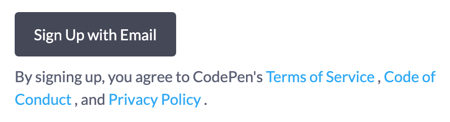
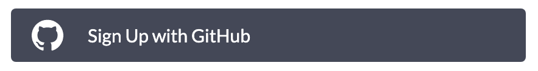
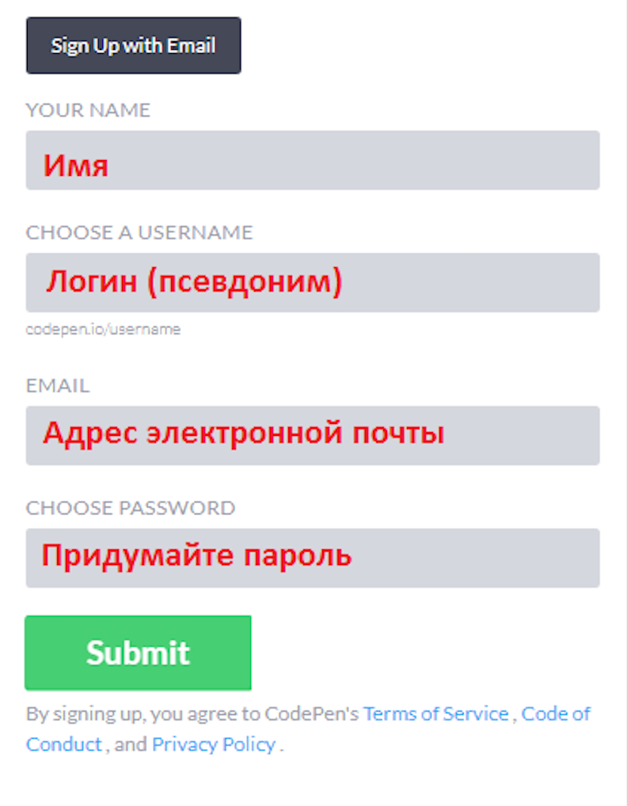
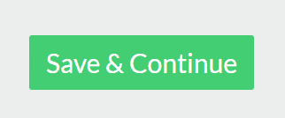
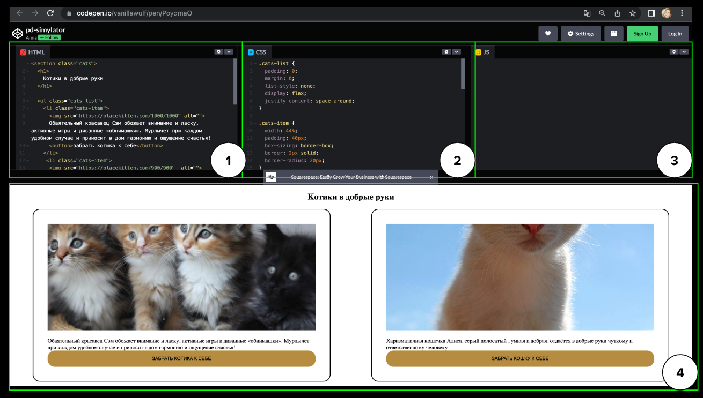
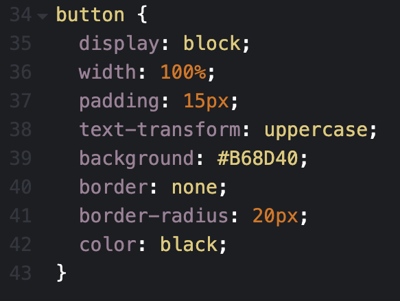
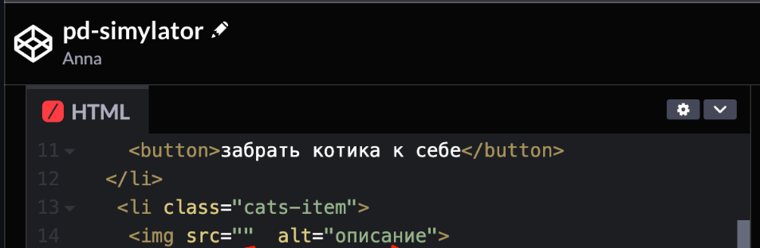

# Задание «Вёрстка страницы сайта питомника животных»

Ваша команда делает сайт и один из членов команды попросил вас доделать начатый им проект. Работа над проектом предполагает работу над вёрсткой страницы сайта.
<details>
  <summary> Что включает в себя вёрстка сайта? (подсказки вам будут доступны по клику)</summary>  
 
Вёрстка страницы сайта представляет собой создание внешнего вида и структуры веб-страницы. Верстальщик использует языки разметки, такие как HTML и CSS, чтобы определить, как элементы на странице будут расположены, как будут выглядеть тексты, изображения, кнопки и другие элементы. Он задает размеры, цвета, шрифты и прочие стили для каждого элемента, чтобы создать приятный и удобный для пользователя интерфейс. 
 
Вёрстка страницы включает в себя размещение контента, создание меню, навигации и общей визуальной атмосферы, чтобы пользователи могли легко перемещаться по сайту и получить нужную информацию.

-----
  
</details>

## Какие инструменты пригодятся для выполнения задачи?

Для работы вам необходимо пройти регистрацию на сервисе CodePen.io.

Регистрация бесплатная и занимает несколько минут. После регистрации вы сможете управлять сохраненными наборами кода, которые называются «пенами» (Pens), и редактировать их в любое время. Несмотря на то, что интерфейс сервиса на английском языке, использовать его довольно просто, и базовых знаний английского будет достаточно для быстрого освоения онлайн-редактора.

<details>
  <summary> Что такое такое CodePen.io и для чего он нужен?</summary>  
 
CodePen.io - это онлайн-платформа, которая позволяет разработчикам и дизайнерам создавать и делиться своим кодом, веб-страницами и интерактивными примерами. То есть CodePen является онлайн песочницей кода. На CodePen.io вы можете писать HTML, CSS и JavaScript код прямо в браузере, а затем видеть результат своей работы в режиме реального времени. Этот сервис полезен, когда нужно показать другим людям свои работы, прототипы или примеры кода, а также для изучения и обмена опытом с другими разработчиками.

-----
  
</details>

<details>
  <summary> Я уже знаю, что такое такое CodePen.io. Как мне зарегистрироваться на CodePen.io?</summary>  

1. Перейдите по [ссылке](https://codepen.io/your-work) и создайте свой аккаунт на CodePen.io 
  


2. Для регистрации вам потребуется почта:


  
или аккаунт на GitHub:
  


Процедура регистрации стандартная. Вам будет предложено ввести общие данные:
 

  
3. На следующей странице можете также заполнить личные данные. Это не обязательно, на ваше усмотрение. Нажмите кнопку «Save & Continue».
 


4. Подтвердите свой аккаунт. Для этого надо перейти по ссылке из вашей электронной почты.

-----
  
</details>

Зайдите под своим аккаунтом в сервис CodePen.io. Если все сделано верно, то вместо кнопок «Sign up» и «Log in» вы увидите свою аватарку:


-----

## Описание работы над проектом

Мы уже начали работать над этой задачей и Пётр уже собрал заготовку, с которой можно ознакомиться по [ссылке](https://codepen.io/vanillawulf/pen/PoyqmaQ).

**Как работать с документом в программе?**

Для работы над проектом вам будут доступны 4 рабочие области (окна, вкладки):



1 - HTML - редактор для работы с кодом HTML,

2 - CSS - редактор для работы с кодом CSS,

3 - JS - редактор для работы с кодом JavaScript (не будет использоваться при работе с текущим проектом),

4 - область для просмотра готового результата в браузере.

<details>
  <summary> Для чего используются HTML, CSS и JavaScript при вёрстке сайта?</summary>  
 
HTML, CSS и JavaScript - это три основные технологии, которые используются в вёрстке страницы сайта.

**HTML (HyperText Markup Language)** отвечает за структуру и содержание страницы. Он определяет, как должны быть расположены различные элементы на странице, такие как заголовки, параграфы, изображения и ссылки.

**CSS (Cascading Style Sheets)** отвечает за внешний вид страницы. С помощью CSS вы можете определить цвета, шрифты, размеры и расположение элементов на странице. Он позволяет придавать странице стиль и оформление, делая ее привлекательной для пользователей.

**JavaScript** - это язык программирования, который добавляет интерактивность на страницу. Он позволяет создавать динамические элементы, обрабатывать события (например, клики или наведение курсора), выполнять анимацию и взаимодействовать с пользователем. JavaScript также может использоваться для отправки и обработки данных на сервере без перезагрузки страницы.

Вместе эти три языка позволяют создавать красивые, структурированные и интерактивные веб-страницы.

-----
  
</details>

Давайте теперь разберём основные рабочие области, с которыми вам предстоит работать. Посмотрим из каких элементов они состоят и как с ними работать.

### HTML

В первой вкладке находится HTML. HTML работает с тегами. 

<details>
  <summary> Что такое тег?</summary>  
 
**Тег** – это семантическое описание вашего контента для браузера. 

Другими словами, тег в HTML - это специальный элемент, который используется для определения различных типов контента на веб-странице. Он заключается в угловые скобки `<>`, и может иметь атрибуты и содержимое. 

Теги обозначают начало и конец определённой части контента, например, заголовка, абзаца, изображения или ссылки. Когда браузер читает HTML-код, он интерпретирует теги и отображает соответствующий контент на странице. Более подробно со списком тегов и других элементов HTML можно познакомиться по [ссылке](https://uguide.ru/tablica-osnovnykh-tegov-html-s-primerami).

-----
  
</details>

В окне HTML можно увидеть тег `<h1>`, который используется для разметки заголовка веб-страницы первого уровня. [Здесь](https://developer.mozilla.org/en-US/docs/Web/HTML/Element/Heading_Elements) можно более подробно прочитать про тег `<h1>`.

В нашем проекте есть заголовок «Котики в добрые руки». При помощи тега `<h1>` мы рассказываем об этом браузеру. 

Здесь используются:

- *открывающий тег* (перед заголовком), чтобы указать, где начинается контент,
- *закрывающий тег* (после заголовка), чтобы указать, где заканчивается заголовок:


### CSS

Во второй вкладке одновременно с HTML проводится работа с оформлением на CSS. CSS позволяет «рассказать» браузеру, как выглядят наши элементы при помощи селекторов и свойств. 

В первой вкладке находится HTML. HTML работает с тегами. 

<details>
  <summary> Хочу узнать подробней про селекторы</summary>  
 
**Селекторы** - это специальные инструкции, которые позволяют выбирать и стилизовать определенные элементы на веб-странице. Они указывают на то, какие элементы или группы элементов должны быть выбраны для применения определенных стилей. Например, селектор может выбирать все заголовки `<h1>` на странице или только элементы с определенным классом или идентификатором. 

Селекторы позволяют задавать цвета, шрифты, размеры и другие стилевые свойства для группы выбранных элементов.

Хотите узнать ещё больше про селектор по тегу? Жмите на [ссылку](https://doka.guide/css/tag-selector/).

-----
  
</details>
  
Давайте посмотрим, как настроена кнопка «забрать котика к себе» в нашем проекте:
  


В левом окне HTML с помощью тега `<button>` мы создали интерактивную кнопку с названием «забрать котика к себе». Почитать про тег `<button>` можно по [ссылке](https://developer.mozilla.org/ru/docs/Web/HTML/Element/button).

В правом окне с помощью CSS настроены стили для кнопки. Код определяет стили и свойства, которые будут применяться к элементам button на веб-странице:
  


Вот что означают эти стили (если интересно узнать про стили больше, переходите по ссылкам к ним):

- `display: block;` - указывает, что элемент будет отображаться как блочный элемент, занимающий всю доступную ширину ([ссылка](https://developer.mozilla.org/en-US/docs/Web/CSS/display)),
- `width: 100%;` - устанавливает ширину элемента в 100% от ширины его родительского контейнера ([ссылка](https://developer.mozilla.org/en-US/docs/Web/CSS/width)),

<details>
  <summary> Что означает «родительский контейнер»?</summary>  
 
**Родительский контейнер** - это элемент на веб-странице, который содержит другие элементы внутри себя. Можно сказать, что это такая «обёртка» или «коробка», которая объединяет и охватывает другие элементы. Родительский контейнер обычно используется для группировки элементов и создания определённой структуры на странице.

Родительский контейнер для кнопки позволяет управлять её внешним видом, позиционированием и взаимодействием с другими элементами на странице, создавая более сложные компоненты и структуры веб-интерфейса.

-----
  
</details>

- `padding: 15px;` - добавляет отступы внутри элемента размером 15 пикселей ([ссылка](https://developer.mozilla.org/ru/docs/Web/CSS/padding)),
- `text-transform: uppercase;` - преобразует текст в заглавные буквы ([ссылка](https://developer.mozilla.org/en-US/docs/Web/CSS/text-transform)),
- `background: #B68D40;` - устанавливает цвет фона элемента в коричневый (#B68D40) ([ссылка](https://developer.mozilla.org/en-US/docs/Web/CSS/background)),
- `border: none;` - удаляет границу элемента ([ссылка](https://developer.mozilla.org/ru/docs/Web/CSS/border)),
- `border-radius: 20px;` - округляет углы элемента с радиусом 20 пикселей ([ссылка](https://developer.mozilla.org/ru/docs/Web/CSS/border-radius)),
- `color: black;` - устанавливает цвет текста внутри элемента на черный ([ссылка](https://developer.mozilla.org/en-US/docs/Web/CSS/color)).

В проекте используется несколько кнопок с однотипным оформлением. Для настройки стилей кнопок используется селектор `button`, который выбирает все элементы кнопок на странице.

В этом случае используется селектор без точки `button`, что позволяет выбрать все элементы кнопок на странице. Селектор без точки - это селектор по имени тега, поэтому браузер применит стили ко всем тегам `button`. В данном случае, при помощи свойства `background` задаётся нужный цвет фону.

## Приступим к выполнению задания и выполним вёрстку

### Готовим копию проекта для работы
  
Прежде, чем вносить изменения в проект, создайте его копию (форк) себе в аккаунт, так как сохранять изменения вы можете только в своем аккаунте. Для этого нажмите «Fork» в нижнем правом углу:


  
### Работаем с тегами и атрибутами
  
1. Пётр сделал описание у котиков в HTML, но совсем забыл подобрать подходящий тег:
  


В HTML контент должен лежать в семантически подходящих тегах (быть «обёрнутым» в тег). 

Абзац хранится в теге `<p>` ([здесь](https://developer.mozilla.org/en-US/docs/Web/HTML/Element/p) о нём больше информации). Ваша задача - обернуть абзац тегом `<p>`. Для этого найдите начало абзаца и поставьте открывающий тег:
  


Теперь браузеру нужно сообщить, где ваш тег закрылся. Для этого разместите закрывающий тег в конец абзаца:
  

  
Давайте проверим, всё ли верно. Пётр добавил отступ между тегом и кнопкой. Если всё сделано верно, то в карточке с первым котиком появиться отступ между текстом и кнопкой, как на рисунке:
  

  
Далее по аналогии с первым рисунком добавьте второй карточке тег `<p>`.

2. Пётр торопился и вставил картинки через тег `` (интересно узнать о теге больше, вам [сюда](https://developer.mozilla.org/en-US/docs/Web/HTML/Element/img)). В теге ` `не заполнен атрибут `"alt"` (отсутствует информация в кавычках `“”`):
  


<details>
  <summary> Для чего используется атрибут  "alt"?</summary>  
 
Атрибут `"alt"` (альтернативный текст) в теге `` предназначен для предоставления текстовой альтернативы изображению на веб-странице. Рекомендуется всегда заполнять атрибут `"alt"` в теге `` значимым и описательным текстом, который передает смысловую информацию о содержимом изображения. 

Вот несколько причин, почему не следует оставлять атрибут `"alt"` пустым:

- если человек читает ваш сайт при помощи скринридера, атрибут `"alt"` является важным для понимания содержимого изображения: текст будет озвучен средствами чтения экрана или показан вместо изображения,
- поисковые системы используют атрибут `"alt"` для понимания содержания изображения и оптимизации работы СЕО для поиска,
- атрибут `"alt"` также может использоваться для предоставления описания содержимого изображения, если с сервером что-то случилось, и картинка не пришла.

-----
  
</details>

Ваша задача - придумать текстовое описание для картинки. Достаточно добавить 2-3 слова и поместить их в атрибут `"alt"`:
  


### Проверим корректность кода

1. Ответственные разработчики должны проверять работу атрибута. Давайте поработаем с атрибутом `"src"`.
  
<details>
  <summary> Для чего используется атрибут  "src"?</summary>  
 
Атрибут `"src"` (source) в теге `` используется для указания пути к файлу изображения, который должен быть отображен на веб-странице. Он определяет источник или URL-адрес изображения.

Атрибут `"src"` является обязательным в теге ``, поскольку он указывает браузеру, откуда загружать изображение для отображения на странице.

-----
  
</details>

Попробуем сымитировать ошибку сервера и удалим путь с картинкой из `“src”`. Если всё выполнено верно, то мы увидим наш `"alt"` на странице:
  


2. Иногда разработчики допускают ошибки по невнимательности или если не привыкли автоматизировать свою работу. После того, как вы закончили работу с HTML, давайте провалидируем свой код и проверим его корректность.

Для этого запустим `Analyze HTML`:
  

  
Валидатор выдал ошибку:
  

  
Вот перевод текста сообщения об ошибке:

```Тег должен быть парным, отсутствует: [ </section> ], не удалось найти совпадение открытого тега [ <section class="cats"> ] в строке 1.```

В редакторе для удобства работы с кодом предусмотрена нумерация строк. Найдите в строке 1 тег `<section>`. Изучите [документацию](https://developer.mozilla.org/en-US/docs/Web/HTML/Element/section) по этому тегу. Посмотрите, как корректно разместить открывающие и закрывающие теги, и поправьте код в секции про котиков.

Если всё сделано верно, то при повторном запуске **analyse**, красная надпись должна исчезнуть.
  
### Поработаем над стилями

1. Вы заметили, что стили для заголовка немного отличаются от того, что было изначально в макете, а именно - размер заголовка меньше. Давайте посмотрим в СSS и найдём стили для заголовка `h1` по селектору тега:
  

  
Если их проверить, то можно найти опечатку в свойстве для задания размера букв. Поправьте опечатку.
  
<details>
  <summary> Подсказка</summary>  
 
Ошибка в коде заключается в опечатке в свойстве `"font-size"`. Вместо `"font-sise"` должно быть `"font-size"`.

После исправления кода свойство `"font-size"` будет применяться к заголовку `h1` с размером шрифта 40 пикселей и выравниванием текста по центру.
  
Более подробно о свойстве `"font-size"` по [ссылке](https://developer.mozilla.org/en-US/docs/Web/CSS/font-size).

-----
  
</details>

Если вы выполнили всё верно, то размер букв должен увеличиться:
  

  
2. Вы заметили, что цвет кнопки совсем не подходит для фона. Найдите заготовленные стили Петра для кнопки у селектора `button`:
  

  
За цвет кнопки отвечает свойство `color` ([ссылка](https://developer.mozilla.org/en-US/docs/Web/CSS/color_value)). Вы решаете погуглить, как задать [подходящее значение у свойства](https://clck.ru/34XibL). Исправьте цвет текста кнопки на белый.
_____
  
**Теперь проект готов к сдаче заказчику. Отправьте ссылку на проект в своём личном кабинете. Ссылку на проект CodePen можно скопировать из адресной строки браузера.**

**Спасибо за помощь!**
