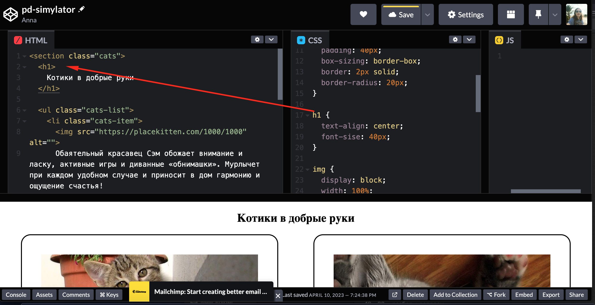

# Задачка для html

# Процесс реализации

1. Создайте аккаунт на в [сервисе codepen.io](https://codepen.io/your-work)


Для регистрации вам потребуется почта или аккаунт гитхаба. 


Более подробно процесс регитсрации описан в
[интсрукции - пунтк 1 - 4](https://github.com/netology-code/guides/tree/master/codepen)


2. Зайдите под своим аккаунтом в сревис кодпен. Если все сделано верно, то вместо кнопок 'sign up' & 'loh in' вы увидите свою аватарку


3. Ваша команда помогает некоммерческим организациям уходить в онлайн. Питомник животных попросил сделать онлайн доску с котиками, которые ждут своих новых хозяев. Разработчик Петя сделал заготовку, но, к сожалению, приболел. И задача доделать страничку переходит к вам.  

4. Изучите заготовку от Пети по [ссылке](https://codepen.io/Netology/pen/mdzpmLY)

В одной вкладке у вас находится html. Html состоит из тегов. Тег - это семантическое описание для барузера о вашем контенте. Например, у нас есть заголовок и мы при помощи тега [h1](https://developer.mozilla.org/ru/docs/Web/HTML/Element/Heading_Elements) рассказываем об этом рбраузеру. Мы исопльзуем открывающий тег <h1>, чтобы указать, где начинается наш контент, и закрывающий тег </h1> чтобы указать, где заканчивается наш заголовок


В другой вкладке css. В css мы расказываем, как выглядит наши элементы при помощи селекторов и свосйств. 
Давайте посмотрим, как работает кнопка. Селектор без точки - это селектор по имени тега, поэтому брауpер применить стили ко всем тегам button. В данном случае, мы при помощи свойства [background](!https://developer.mozilla.org/en-US/docs/Web/CSS/background) задаем нужный [цвет фону](!https://www.colorhexa.com/b68d40)


5. Сделайте себе форк(копию проекта) к себе в аккаунт 


6. Петя сделал описание у котиков в html, но совсем забыл подобрать подходящий тег. 


В html контент должен лежать в семантически подходящих тегах. Абзац хранится в [теге p](!https://developer.mozilla.org/ru/docs/Web/HTML/Element/p)
Ваша задача обернуть абзац тегом р.
Для этого найдите начала абзаца и поставьте открывающие тег - <p>

Теперь браузеру нужно сообщать, где ваш тег гакрылся. Для этого разместите закрывающий тег тег в конец абзаца - </p>
 

7. Проверим, все ли верно - Петя добавил отсутп между тегом и кнопкой. Если все сделано верно, то у первого котика появиться отступ между тектом и кнопкой


8. Добавьте второй карточке по аналогии с предыдщуим пунктом тег р.

9. Петя торопился и вставил картинки через тег [img](!https://developer.mozilla.org/ru/docs/Web/HTML/Element/img).
Вы тщательно изучили описания тега img и пришли к выводу, что ни в коем случае нельзя оставлять атрибут alt пустым.Так он отвечает за описание картинки и будет полезе
* если с сервером что-то случилось, и картинка не пришла
* если человек читает ваш сайт при помощи скринридера


Ваша задача: придумать текстовое описание для картинки - достаточно 2-3 слов и пометсить его в атрибут alt.

10. Как ответственные разработчики мы должны провреить работу нашего атрибута. Давайте попробуйем симтировать ошибку сервера и удалим путь с картинкой из src. Если все верно, то мы увидим наш альт на странице


11. Вы понимате, что иногда разработчики допускают ошибки по невнимательности и не привыкли автоматизировать свою работу. После того, как вы закончили html вы хотите провалидировать ваш код (узнать все ли корректно)


Валидатор выдал вам ошибку, которую вы перевели.
```Тег должен быть парным, отсутствует: [ </section> ], не удалось найти совпадение открытого тега [ <section class="cats"> ] в строке 1.```


Вы обратили внимание, что у вас в первой строчке есть [тег section](https://developer.mozilla.org/en-US/docs/Web/HTML/Element/section) 
Изучив документацию, вы поняли, что Петя забыл поместить закрывающий тег section в конец своей логический секции про котиков - добавьте </section> в конец кода

12. Если все сделано верно, то при повтонрном запуске analyse, красная подпись должна пропасть.

13. Вы заметили, что стили для заголовка немного отличаются от того, что было изначально в макете, а именно размер заголовка меньше. Вы решаете заглянуть в css и находите стили для заголовка h1 по селектору тега


Вы начинаете их проверять и находите опечатку с [свойстве для задания размера букв](!https://developer.mozilla.org/en-US/docs/Web/CSS/font-size) 

Поправьте опечатку. 

13. Если все верно, то размер букв должен увеличиться


14. Вы заметили, что цвет кнопки совсем не подходит для фона.


Вы нашли заготовленные стили Пети для кнопки у селектора button


За цвет кнопки отвечает свойство [color](https://developer.mozilla.org/en-US/docs/Web/CSS/color_value)

Вы решаете подгуглить, как задать [подходящее значение у свойства](https://www.google.com/search?q=white+color+css&sxsrf=APwXEdfYvRSZTKirPNVwgrH_14elxe65Fw%3A1681137122844&ei=4h00ZMWXM8_OkgWAq5j4Bw&ved=0ahUKEwjFkJrow5_-AhVPp6QKHYAVBn8Q4dUDCA8&uact=5&oq=white+color+css&gs_lcp=Cgxnd3Mtd2l6LXNlcnAQAzIHCAAQDRCABDIGCAAQBxAeMgYIABAHEB4yBggAEAcQHjIGCAAQBxAeMgYIABAHEB4yBggAEAcQHjIGCAAQBxAeMggIABCABBDLATIGCAAQBRAeOgoIABBHENYEELADOgoIABCKBRCwAxBDOgQIIxAnOggIABAIEAcQHkoECEEYAFDBA1jjCGD4C2gBcAF4AIABiAOIAfYIkgEHMC41LjAuMZgBAKABAcgBCsABAQ&sclient=gws-wiz-serp)

Исправьте цвет текста кнопки на белый.


